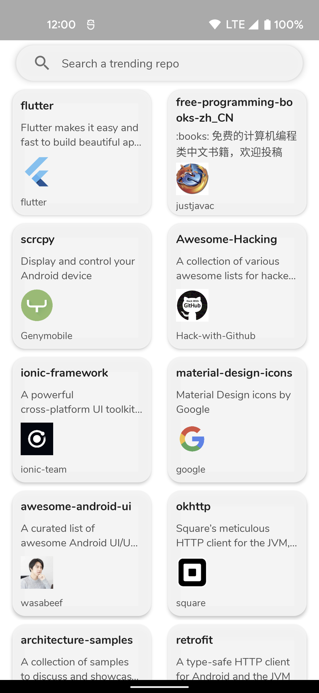
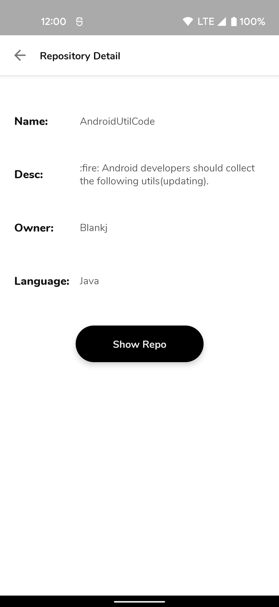
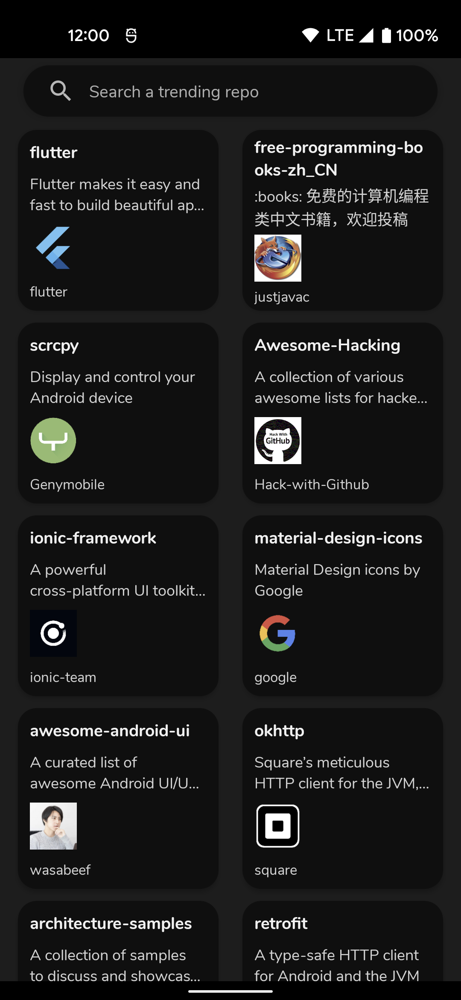
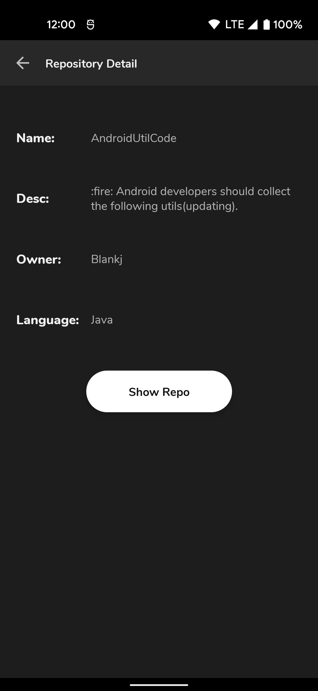
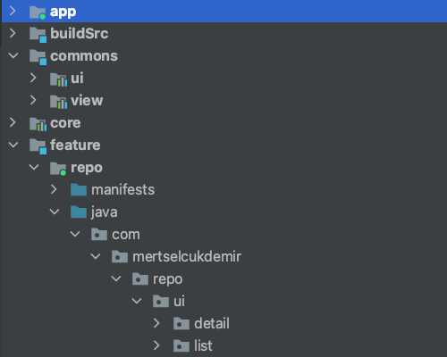

# Xapo Android Interview Test Project

## Design

In terms of design has been followed recommendations [android material design](https://developer.android.com/guide/topics/ui/look-and-feel) comprehensive guide for visual, motion, and interaction design across platforms and devices. Granting the project in this way a great user experience (UX) and user interface (UI). For more info about UX best practices visit [link](https://developer.android.com/topic/google-play-instant/best-practices/apps).

[dark theme](https://developer.android.com/guide/topics/ui/look-and-feel/darktheme) has been implemented support for improving visibility with low vision and those who are sensitive to bright light

| Mode  | Repo list                                                                | Repo detail                                                               |
|-------|--------------------------------------------------------------------------|---------------------------------------------------------------------------|
| Light |                    |                   |
| Dark  |                      |                     |

## Architecture

The architecture of the application is based, apply and strictly complies with each of the following 5 points:

-   A single-activity architecture, using the [Navigation component](https://developer.android.com/guide/navigation/navigation-getting-started) to manage fragment operations.
-   [Android architecture components](https://developer.android.com/topic/libraries/architecture/), part of Android Jetpack for give to project a robust design, testable and maintainable.
-   Pattern [Model-View-ViewModel](https://en.wikipedia.org/wiki/Model%E2%80%93view%E2%80%93viewmodel) (MVVM) facilitating a [separation](https://en.wikipedia.org/wiki/Separation_of_concerns) of development of the graphical user interface.
-   [S.O.L.I.D](https://en.wikipedia.org/wiki/SOLID) design principles intended to make software designs more understandable, flexible and maintainable.
-   [Modular app architecture](https://proandroiddev.com/build-a-modular-android-app-architecture-25342d99de82)

### Modules

Modules are collection of source files and build settings that allow you to divide a project into discrete units of functionality. In this case apart from dividing by functionality/responsibility, existing the following dependence between them:

-   `:app` depends on `:core` and indirectly depends on `:feature` by dynamic-features.
-   `:feature` modules depends on `:commons`, `:core`, `:libraries` and `:app`.
-   `:core` and `:commons` only depends for possible utils on `:libraries`.

## Tech-stack

This project takes advantage of many popular libraries, plugins and tools of the Android ecosystem. Most of the libraries are in the stable version, unless there is a good reason to use non-stable dependency.

This project takes advantage of many popular libraries, plugins and tools of the Android ecosystem. Most of the libraries are in the stable version, unless there is a good reason to use non-stable dependency. Also, this project supports Android API 23+.

### Dependencies

-   [Jetpack](https://developer.android.com/jetpack):
    -   [Android KTX](https://developer.android.com/kotlin/ktx.html) - provide concise, idiomatic Kotlin to Jetpack and Android platform APIs.
    -   [AndroidX](https://developer.android.com/jetpack/androidx) - major improvement to the original Android [Support Library](https://developer.android.com/topic/libraries/support-library/index), which is no longer maintained.
    -   [Data Binding](https://developer.android.com/topic/libraries/data-binding/) - allows you to bind UI components in your layouts to data sources in your app using a declarative format rather than programmatically.
    -   [Lifecycle](https://developer.android.com/topic/libraries/architecture/lifecycle) - perform actions in response to a change in the lifecycle status of another component, such as activities and fragments.
    -   [LiveData](https://developer.android.com/topic/libraries/architecture/livedata) - lifecycle-aware, meaning it respects the lifecycle of other app components, such as activities, fragments, or services.
    -   [Navigation](https://developer.android.com/guide/navigation/) - helps you implement navigation, from simple button clicks to more complex patterns, such as app bars and the navigation drawer.
    -   [Paging](https://developer.android.com/topic/libraries/architecture/paging/) - helps you load and display small chunks of data at a time. Loading partial data on demand reduces usage of network bandwidth and system resources.
    -   [ViewModel](https://developer.android.com/topic/libraries/architecture/viewmodel) - designed to store and manage UI-related data in a lifecycle conscious way. The ViewModel class allows data to survive configuration changes such as screen rotations.
-   [Coroutines](https://kotlinlang.org/docs/reference/coroutines-overview.html) - managing background threads with simplified code and reducing needs for callbacks.
-   [Dagger2](https://dagger.dev/) - dependency injector for replacement all FactoryFactory classes.
-   [Retrofit](https://square.github.io/retrofit/) - type-safe HTTP client.
-   [Coil](https://github.com/coil-kt/coil) - image loading library for Android backed by Kotlin Coroutines.
-   [Moshi](https://github.com/square/moshi) - makes it easy to parse JSON into Kotlin objects.
-   [Timber](https://github.com/JakeWharton/timber) - a logger with a small, extensible API which provides utility on top of Android's normal Log class.
-   [and more...](https://github.com/xapo-android-interviews/test-project-mertselcukdemir/blob/develop/buildSrc/src/main/kotlin/dependencies/Dependencies.kt)

## Mad Scorecard

## Notes
When the project is compiled, you can see 2 occured warnings. You can find the reasons for these warnings caused by libraries in the references below:

-   [Warning 1] (https://issuetracker.google.com/issues/159542337)
-   [Warning 2] (https://github.com/square/moshi/issues/1463)